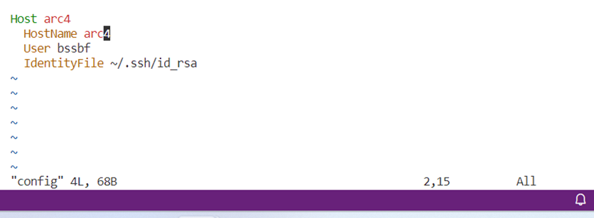
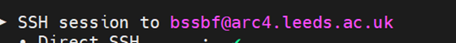
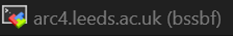
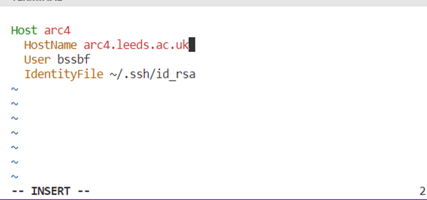
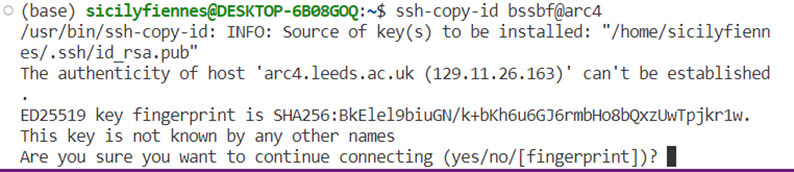
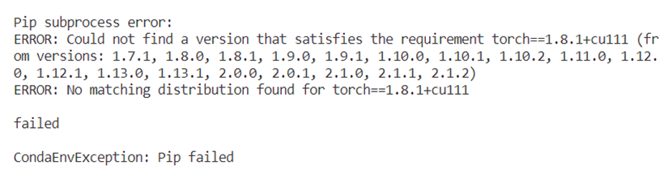

# Coding Diary
# Things/commands to remember
* Ctrl + C to cancel your code running
* When opening the VM
```
module load anaconda
conda activate cv4e2

cd cv4e_cagedbird_ID *Tab* 
```

* The process of committing, to remind myself
```
git add .
git commit -m "...."
git status
git push
```
* Submitting jobs to the scheduler

```
qsub first_gpu.sh
qstat to check the status of your job
```

## Daily coding notes
**Notes from early March**


* when writing in the config file when setting up the VM, I put arc4 also as the hostname, though the hostname in MobaXTerm was this: 


* And also in the name/heading for the whole session is



I changed this now to in the config file to 



Then I did this in the command line
```
ssh key-gen bssbf@arc4
```



From the species_to_review folder, the was a V_CODES folder and in there was the folder that used to be called data, and it was temporarily called ‘cleaned_29_species_vs_code_version’, now I will rename it on my ARC4 HPC account as ‘data’ again. At the moment this is 913 MB.

I need to make a new conda environment
On the Leeds HPC, I need to do ‘module load anaconda’ first, then conda works; https://arcdocs.leeds.ac.uk/software/compilers/anaconda.html?highlight=conda

Then I did this in the command line, after logging on using WSL, then open the Remote tunnel to log into my arc4 account. The environment.yml file was cloned from my previous Github repository.

```
conda env create -f environment.yml -n cv4e
module load anaconda
source activate base
conda activate cv4e
```
*The path for my new environment, is '/home/home01/bssbf/.conda/envs/cv4e'

*How to list what has gone on so far with your environment, reminder that cat is like Linux for printing: 	

```
cat /home/home01/bssbf/.conda/envs/cv4e/logs/environment_creation.log
```
* **issue with installing cuda**

SpecNotFound: Invalid name 'cv4e', try the format: user/package
Then I changed the directory to the cv4e_cagebird_ID which is where the environment file is actually located.



* I’ve made a new environment.yml without the + cu111 appended to the end of the torchvison command, after doing the module add cuda. So then I made this new environment
```
conda env create -f environment2.yml -n cv4e2
```
* Might be a cuda clash but I’ll load it in the new environment. Does it matter if I have conflicting cuda versions?
https://arcdocs.leeds.ac.uk/usage/gpgpu.html?highlight=gpu 

```
module unload cuda/10.1.168
module load cuda/11.1.1 # the correct version
```

* **Testing running files on the scheduler**
* I’m on login 1; Scheduler is on a different node, shared resources

```
pwd
ls
cd test/
ls
test.sh
cat test.sh
qsub nameoffile
qstat
```

**15/3/24**
* I needed to change the annoPath that leads correctly to the train.json
* It used to be like this: '/home/sicily/cv4e_cagedbird_ID/data/high/train.json'
* But now we don’t have a data/high folder, it’s just data, and then the species
* Now this is the new annoPath, that I need to change
/home/home01/bssbf/cv4e_cagedbird_ID/data/train.json
* This change will be made in the /home/home01/bssbf/cv4e_cagedbird_ID/ct_classifier/dataset.py file
* The data_root stays the same, so I will # the line where, ‘high’ was, as an extra line
* It’s change the annoPath code, but also re-enter in the file path for the data_root itself; need to change the main config file, in the configs folder; /home/home01/bssbf/cv4e_cagedbird_ID/configs/exp_resnet18.yaml

**15/07/24**

* I had this error initially: train.py: error: unrecognized arguments: ., but there was an extra dot before the '>'.

```
python example_file.py > output.txt
```
* Ran a model successfully, with the output correctly exported to the output.txt file and also in the shell output files

# Coding check list

## Major
* [ ] Connecting models end to end (cropper to species detector)
* [ ] Training the original model on more species
* [ ] Train a cropper and feed those results to the first model
* [ ] could train the cropped model on the initial yolo results than test the detector on the ones for which we don't have enough crops
* [ ] 20 minimum folder also has some species that are nearer to 100, this needs to be further sorted

## Minor
* [ ] Sort out the number of species I can actually work with
* [ ] List of species that I observed in markets (interactive html format with an example image)
* [ ] Species, file names etc for James to review
* [ ] Re-connect your work to comet
* [ ] The first column in our database ('Market_data_ID') has the crops but there is some independence issues so we need to label the source and discard ones

## Extra 
* [ ] Caged bar augmenter


11/01/24
comet_ml not working when imported, I tried running this code to update it, but this will now be specfic to this cv4e2 environment, I might then need to update the environment.yml file later?
pip install comet_ml --upgrade